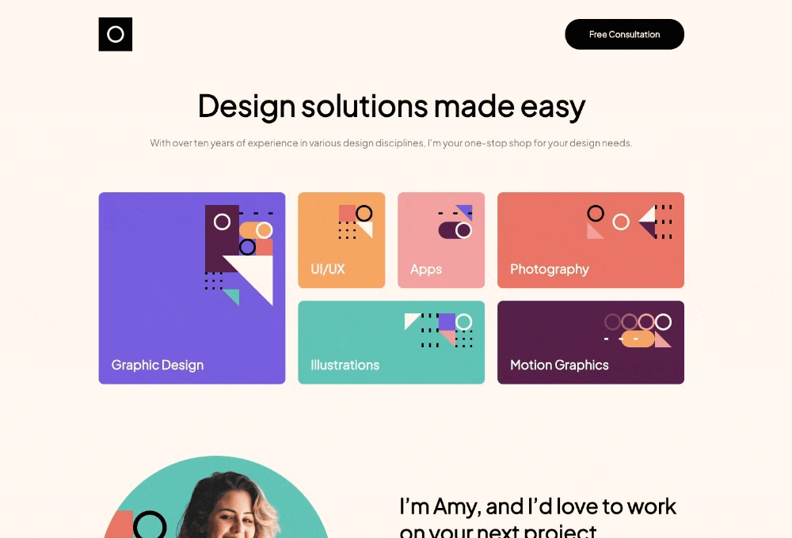
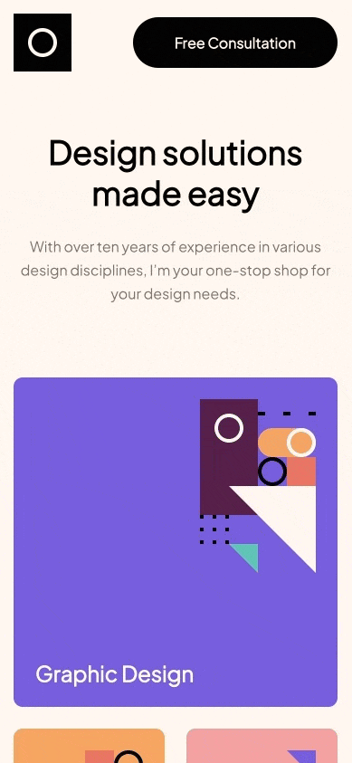

# Frontend Mentor - Single-page design portfolio solution

This is a solution to the [Single-page design portfolio challenge on Frontend Mentor](https://www.frontendmentor.io/challenges/singlepage-design-portfolio-2MMhyhfKVo). Frontend Mentor challenges help you improve your coding skills by building realistic projects.

## Table of contents

- [Overview](#overview)
  - [The challenge](#the-challenge)
  - [Screenshot](#screenshots)
  - [Links](#links)
- [My process](#my-process)
  - [Built with](#built-with)
  - [What I learned](#what-i-learned)
  - [Continued development](#continued-development)
  - [Useful resources](#useful-resources)
- [Author](#author)

## Overview

### The challenge

Users should be able to:

- View the optimal layout for the site depending on their device's screen size
- See hover states for all interactive elements on the page
- Navigate the slider using either their mouse/trackpad or keyboard

### Screenshots

#### Desktop

#### Mobile

### Links

- Solution URL: [https://github.com/pcrescini/single-page-design-portfolio](https://github.com/pcrescini/single-page-design-portfolio)
- Live Site URL: [https://polite-cannoli-f0fdc2.netlify.app/](https://polite-cannoli-f0fdc2.netlify.app/)

## My process

### Built with

- Semantic HTML5 markup
- Flexbox
- CSS Grid
- [Sass](https://sass-lang.com/) - CSS Preprocessor
- [Parcel](https://parceljs.org/) - Web Application Bundler
- [Embla Carousel](https://www.embla-carousel.com/) - Lightweight carousel library

### What I learned

It's been a while since I've worked on a project using Sass so I took this as an opportunity refresh my skills. The first thing I discover is that node-sass is deprecated and that folks should use Dart Sass instead. Once that issue was addressed, the next thing I needed to decide on was which tool should I use to compile SCSS to CSS. All my previous Sass experience was with using Gulp and I wanted to explore other options. This is how I came upon Parcel which turned out really easy to use.

### Continued development

One thing I've learned over my career is that while it's certainly possible to code your own solution for an image carousel/slider, there is no shame in using a library that will help make the implementation process easier. I've used Bootstrap, Owl Carousel, and Splide to implement carousel/sliders in past projects and I wanted to see what other options are out there. While I chose Embla Carousel for this project, I've read great things about Swiper and can't wait to try it in future projects.

### Useful resources

- [Kevin Powell ](https://www.youtube.com/@KevinPowell/featured) - Kevin Powell is such an awesome resource for all things CSS related.
- [Sass](https://sass-lang.com/) - One of the best advice I ever received regarding web development is to always read the docs. 😉

## Author

- Website - [paulcrescini.com](https://www.paulcrescini.com)
- Frontend Mentor - [@pcrescini](https://www.frontendmentor.io/profile/pcrescini)
- Twitter - [@paulccrescini](https://www.twitter.com/paulccrescini)
